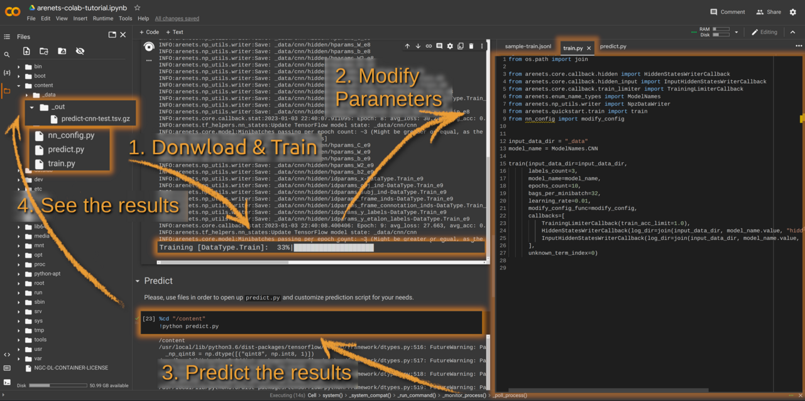

# AREnets


[](https://colab.research.google.com/github/nicolay-r/AREnets/blob/master/arenets_colab_tutorial.ipynb)

<p align="center">
    
</p>


**AREnets** -- is an [OpenNRE](https://github.com/thunlp/OpenNRE) like project, but the kernel based on [tensorflow](https://www.tensorflow.org/)
library, with implementation of neural networks on top of it, designed for **A**ttitude and **R**elation **E**xtraction tasks.
AREnets is a result of advances in [Sentiment Attitude Extraction task](http://nlpprogress.com/russian/sentiment-analysis.html)
but introduced in generalized form and applicable for other relation-extraction related classification tasks. 
It provides ready to use [neural networks](#models-list) and API for `subject`→`object` pairs classification in a given samples. 
This project is powered by 
[AREkit](https://github.com/nicolay-r/AREkit) 
core API, squeezed into a tiny 
[kernel](https://github.com/nicolay-r/AREnets/tree/dev/arenets/arekit).

## Contents
* [Installation](#installation)
* [Quick Start](#quick-start)
* [Models List](#models-list)
* [FAQ](#faq)
* [Test Details](#test-details)
* [How to cite](#how-to-cite)

## Installation

```bash
pip install git+https://github.com/nicolay-r/AREnets@master
```

## Quick Start
[](https://colab.research.google.com/github/nicolay-r/AREnets/blob/master/arenets_colab_tutorial.ipynb)

Simply just open and follow the [google-colab](https://colab.research.google.com/github/nicolay-r/AREnets/blob/master/arenets_colab_tutorial.ipynb) 
version like IDE to modify the train and inference code of provided tutorial:
<p align="center">
    
</p>

The complete examples are in [tutorials](tutorials) folder.

First of all, prepare your `_data` folder with data required for training model and performing inference.
* **Input samples**: check out [input data formatting guide](docs/input_data.md).
* **Embeddings** could be obtained from [NLPL repository](http://vectors.nlpl.eu/repository/), 
  with `model.txt` file placed at `_data` folder; 
    * See [downloading script](tutorials/_data/download_embedding.sh);

More on input features could be [found here](docs/input_features.md).

### Train
```python
from arenets.quickstart.train import train
from arenets.enum_name_types import ModelNames

train(input_data_dir="_data", labels_count=3, model_name=ModelNames.CNN, epochs_count=10)
```
Runs `cnn` model with `10` epochs for `3-class` classification problem; 
all the model-related details will be stored at `_data` model by default.

### Predict 
```python
from arenets.quickstart.predict import predict
from arenets.arekit.common.data_type import DataType
from arenets.enum_name_types import ModelNames

predict(input_data_dir="_data", output_dir="_out", labels_count=3, model_name=ModelNames.CNN, data_type=DataType.Test)
```
Predict `test` results for pre-trained `cnn` model and saves them into `_out` folder

## Models List

* **Aspect-based Attentive encoders**:
    - Multilayer Perceptron (MLP)
        [[code]](arenets/attention/architectures/mlp.py) /
        [[github:nicolay-r]](https://github.com/nicolay-r/mlp-attention);
* **Self-based Attentive encoders**:
    - P. Zhou et. al.
        [[code]](arenets/attention/architectures/self_p_zhou.py) /
        [[github:SeoSangwoo]](https://github.com/SeoSangwoo/Attention-Based-BiLSTM-relation-extraction);
    - Z. Yang et. al.
        [[code]](arenets/attention/architectures/self_z_yang.py) /
        [[github:ilivans]](https://github.com/ilivans/tf-rnn-attention);
* **Single Sentence Based Architectures**:
    - CNN
        [[code]](arenets/context/architectures/cnn.py) /
        [[github:roomylee]](https://github.com/roomylee/cnn-relation-extraction);
    - CNN + Aspect-based MLP Attention
        [[code]](arenets/context/architectures/base/att_cnn_base.py);
    - PCNN
        [[code]](arenets/context/architectures/pcnn.py) /
        [[github:nicolay-r]](https://github.com/nicolay-r/sentiment-pcnn);
    - PCNN + Aspect-based MLP Attention
        [[code]](arenets/context/architectures/base/att_pcnn_base.py);
    - RNN (LSTM/GRU/RNN)
        [[code]](arenets/context/architectures/rnn.py) /
        [[github:roomylee]](https://github.com/roomylee/rnn-text-classification-tf);
    - IAN (frames based)
        [[code]](arenets/context/architectures/ian_frames.py) /
        [[github:lpq29743]](https://github.com/lpq29743/IAN);
    - RCNN (BiLSTM + CNN)
        [[code]](arenets/context/architectures/rcnn.py) /
        [[github:roomylee]](https://github.com/roomylee/rcnn-text-classification);
    - RCNN + Self Attention
        [[code]](arenets/context/architectures/rcnn_self.py);
    - BiLSTM
        [[code]](arenets/context/architectures/bilstm.py) /
        [[github:roomylee]](https://github.com/roomylee/rnn-text-classification-tf);
    - Bi-LSTM + Aspect-based MLP Attention 
        [[code]](arenets/context/architectures/base/att_bilstm_base.py)
    - Bi-LSTM + Self Attention
        [[code]](arenets/context/architectures/self_att_bilstm.py) /
        [[github:roomylee]](https://github.com/roomylee/self-attentive-emb-tf);
    - RCNN + Self Attention
        [[code]](arenets/context/architectures/att_self_rcnn.py);
* **Multi Sentence Based Encoders Architectures**:
    - Self Attentive 
        [[code]](arenets/multi/architectures/att_self.py);
    - Max Pooling
        [[code]](arenets/multi/architectures/max_pooling.py) /
        [[paper]](https://pdfs.semanticscholar.org/8731/369a707046f3f8dd463d1fd107de31d40a24.pdf);
    - Single MLP
        [[code]](arenets/multi/architectures/base/base_single_mlp.py);
      
## FAQ

#### [How to prepare input data?](docs/input_data.md)
#### [How to setup `jsonl` or `csv` data reader?](data/input_readers.md)
#### [How to implement a custom model with attention?](docs/tutorial_attention.md)
#### [How to customize the prediction output?](docs/tutorial_predict_output.md)

## Test Details

This project has been tested under the following setup:
* NVidia GTX-1060/1080 TI
* CUDA compilation tools, release 10.0, V10.0.130
* Python 3.6.9
* Pandas 0.25.3 (Optional, only for `CSV` reading)
* [Pip freeze package list](docs/pip-freeze-list.txt)

## How to cite

Our one and my personal interest is to help you better explore and analyze attitude and relation extraction related tasks with AREnets.
A great research is also accompanied with the faithful reference.
if you use or extend our work, please cite as follows:
```
@misc{arenets2023,
  author={Nicolay Rusnachenko},
  title={{AREnets}: Tensorflow-based framework of attentive neural-network 
         models for text classfication and relation extraction tasks},
  year={2023},
  url={https://github.com/nicolay-r/AREnets},
}
```
