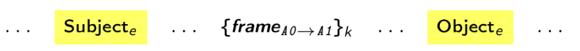

# AREnets


[](https://colab.research.google.com/github/nicolay-r/AREnets/blob/master/arenets_colab_tutorial.ipynb)


**AREnets** -- is an [OpenNRE](https://github.com/thunlp/OpenNRE) like project, but the kernel based on [tensorflow](https://www.tensorflow.org/)
library, with implementation of neural networks on top of it, designed for **A**ttitude and **R**elation **E**xtraction tasks.
This project is powered by 
[AREkit](https://github.com/nicolay-r/AREkit) 
core API, squeezed into a tiny 
[kernel](https://github.com/nicolay-r/AREnets/tree/dev/arenets/arekit).

## Contents
* [Installation](#installation)
* [Quick Start](#quick-start)
* [Input Features](#input-features)
* [Models List](#models-list)
* [Test Details](#test-details)
* [Related Frameworks](#related-frameworks)

## Installation

```bash
pip install git+https://github.com/nicolay-r/AREnets@master
```

## Quick Start
[](https://colab.research.google.com/github/nicolay-r/AREnets/blob/master/arenets_colab_tutorial.ipynb)

The complete examples are in [tutorials](tutorials) folder.

### Train
Prepare data at `_data` and run:
```python
from arenets.quickstart.train import train
from arenets.enum_name_types import ModelNames

train(input_data_dir="_data", labels_count=3, model_name=ModelNames.CNN, epochs_count=10, train_acc_limit=0.9)
```
Means run `cnn` model with `10` epochs and stop training for `3` class classification problem,
up to moment once `train_acc_limit` won't be reached; 
all the model-related details will be stored at `_data` model by default.

### Infer
Use data at `_data` and run:
```python
from arenets.quickstart.predict import predict
from arenets.arekit.common.data_type import DataType
from arenets.enum_name_types import ModelNames

predict(input_data_dir="_data", output_dir="_out", labels_count=3, model_name=ModelNames.CNN, data_type=DataType.Test)
```
Means save results to `_out` folder for a model `cnn` located at `_data` by default.

## Input features



Input embedding enlarged with the task specific features.
[[code]](https://github.com/nicolay-r/AREnets/blob/05e53b7637f57a1ce534519f2440d6553150a686/arenets/sample.py#L16)
[[list-of-files]](https://github.com/nicolay-r/AREnets/tree/dev/arenets/features)

* Frame labels [[code]](arenets/features/term_frame_roles.py) -- connotations, for frames presented in context.
* Distance-Feature [[code]](arenets/features/sample_dist.py):
    * Distance from `Subject` to other context terms;
    * Distance from `Object` to other context terms;
    * Absolute distance to any `Subject` in context;
    * Absolute distance to any `Object` in context;
* Term-types [[code]](arenets/features/term_types.py)
* Part-Of-Speech tags

## Models List

* **Aspect-based Attentive encoders**:
    - Multilayer Perceptron (MLP)
        [[code]](arenets/attention/architectures/mlp.py) /
        [[github:nicolay-r]](https://github.com/nicolay-r/mlp-attention);
* **Self-based Attentive encoders**:
    - P. Zhou et. al.
        [[code]](arenets/attention/architectures/self_p_zhou.py) /
        [[github:SeoSangwoo]](https://github.com/SeoSangwoo/Attention-Based-BiLSTM-relation-extraction);
    - Z. Yang et. al.
        [[code]](arenets/attention/architectures/self_z_yang.py) /
        [[github:ilivans]](https://github.com/ilivans/tf-rnn-attention);
* **Single Sentence Based Architectures**:
    - CNN
        [[code]](arenets/context/architectures/cnn.py) /
        [[github:roomylee]](https://github.com/roomylee/cnn-relation-extraction);
    - CNN + Aspect-based MLP Attention
        [[code]](arenets/context/architectures/base/att_cnn_base.py);
    - PCNN
        [[code]](arenets/context/architectures/pcnn.py) /
        [[github:nicolay-r]](https://github.com/nicolay-r/sentiment-pcnn);
    - PCNN + Aspect-based MLP Attention
        [[code]](arenets/context/architectures/base/att_pcnn_base.py);
    - RNN (LSTM/GRU/RNN)
        [[code]](arenets/context/architectures/rnn.py) /
        [[github:roomylee]](https://github.com/roomylee/rnn-text-classification-tf);
    - IAN (frames based)
        [[code]](arenets/context/architectures/ian_frames.py) /
        [[github:lpq29743]](https://github.com/lpq29743/IAN);
    - RCNN (BiLSTM + CNN)
        [[code]](arenets/context/architectures/rcnn.py) /
        [[github:roomylee]](https://github.com/roomylee/rcnn-text-classification);
    - RCNN + Self Attention
        [[code]](arenets/context/architectures/rcnn_self.py);
    - BiLSTM
        [[code]](arenets/context/architectures/bilstm.py) /
        [[github:roomylee]](https://github.com/roomylee/rnn-text-classification-tf);
    - Bi-LSTM + Aspect-based MLP Attention 
        [[code]](arenets/context/architectures/base/att_bilstm_base.py)
    - Bi-LSTM + Self Attention
        [[code]](arenets/context/architectures/self_att_bilstm.py) /
        [[github:roomylee]](https://github.com/roomylee/self-attentive-emb-tf);
    - RCNN + Self Attention
        [[code]](arenets/context/architectures/att_self_rcnn.py);
* **Multi Sentence Based Encoders Architectures**:
    - Self Attentive 
        [[code]](arenets/multi/architectures/att_self.py);
    - Max Pooling
        [[code]](arenets/multi/architectures/max_pooling.py) /
        [[paper]](https://pdfs.semanticscholar.org/8731/369a707046f3f8dd463d1fd107de31d40a24.pdf);
    - Single MLP
        [[code]](arenets/multi/architectures/base/base_single_mlp.py);

## Test Details

This project has been tested under the following setup:
* NVidia GTX-1060/1080 TI
* Python 3.6.9
* [Pip freeze package list](docs/pip-freeze-list.txt)
* Cuda compilation tools, release 10.0, V10.0.130

## Related Frameworks

*  **OpenNRE** [[github]](https://github.com/thunlp/OpenNRE) [[paper]](https://aclanthology.org/D19-3029.pdf)

## Referece

```
@misc{arenets2023,
  author={Nicolay Rusnachenko},
  title={AREnets: Tensorflow-based framework of neural-network applicable 
         models for attitude and relation extraction tasks},
  year={2023},
  url={https://github.com/nicolay-r/AREnets},
}
```
