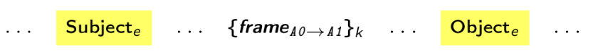

## Input features

Input embedding enlarged with the task specific features.
[[code]](https://github.com/nicolay-r/AREnets/blob/05e53b7637f57a1ce534519f2440d6553150a686/arenets/sample.py#L16)
[[list-of-files]](https://github.com/nicolay-r/AREnets/tree/dev/arenets/features)

* Frame labels [[code]](arenets/features/term_frame_roles.py) -- connotations, for frames presented in context.
* Distance-Feature [[code]](arenets/features/sample_dist.py):
    * Distance from `Subject` to other context terms;
    * Distance from `Object` to other context terms;
    * Absolute distance to any `Subject` in context;
    * Absolute distance to any `Object` in context;
* Term-types [[code]](arenets/features/term_types.py)
* Part-Of-Speech tags
